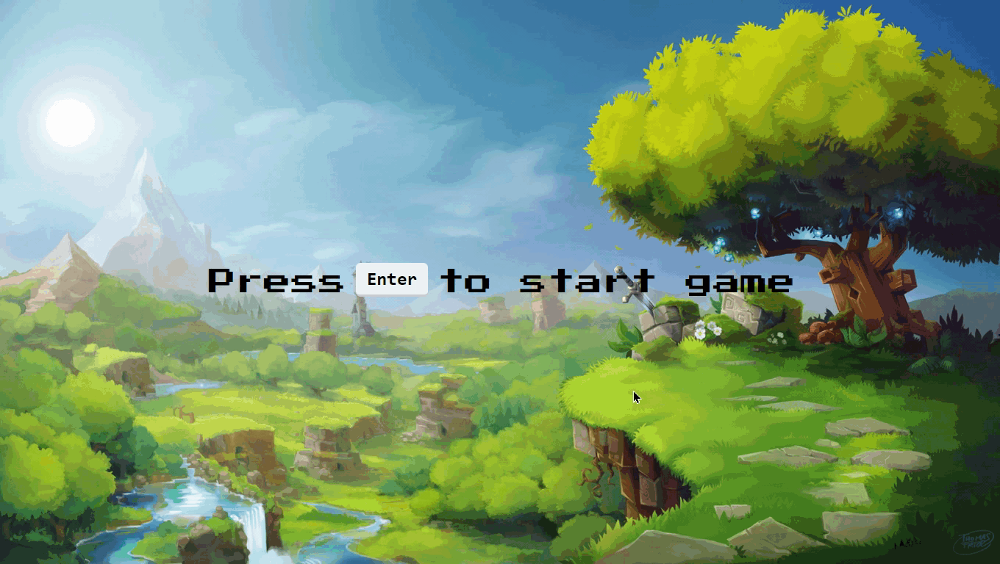

# devideas-nodets
> a simple rpg minigame with React.JS <3

## Technology stack

* **Front-End:** [React.js](https://reactjs.org/)
* **Typing:** [Typescript](https://www.typescriptlang.org/)
* **Deployment:** [Vercel](https://vercel.com/dashboard)

## Running locally

### Installation
`npm install`

### To run the project
`npm run dev`

© Marcos Andre